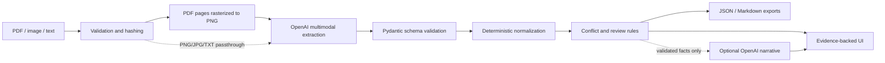

# CareLens — Clinical Document Intelligence Hub

CareLens is a complete three-day POC for reconciling synthetic clinical PDFs, images, and text into an evidence-grounded care-transition review. It uses OpenAI for multimodal extraction and optional narrative synthesis, while deterministic code handles normalization, conflict detection, confidence, routing, and auditability.

> **Safety boundary:** synthetic demonstration only. Not for diagnosis, treatment, or clinical use. Every output requires qualified human review.

## What makes the POC acceptance-ready

- Multimodal input: PDF, PNG/JPG, and TXT, with batch and size limits.
- Typed OpenAI extraction: strict JSON Schema validated with Pydantic.
- Evidence first: each extracted fact retains filename, page, and a short source quote.
- Cross-document reconciliation: detects identity, medication, and allergy contradictions.
- Transparent review routing: `REVIEW NOW`, `REVIEW SOON`, or `ROUTINE` from explainable rules.
- Graceful degradation: partial document failures and optional synthesis failures preserve usable output.
- Exportable audit trail: structured JSON and a reviewer-friendly Markdown brief.
- Reproducible evaluation: saved synthetic dataset, golden expectations, and automated tests.

## Quick start on Windows

The requested virtual environment is already created at `.venv`.

```powershell
.\.venv\Scripts\Activate.ps1
pip install -r requirements-dev.txt
Copy-Item .env.example .env
# Add your OpenAI key to .env; never commit that file.
streamlit run streamlit_app.py
```

Open `http://localhost:8501`, choose **Review now — conflicts and critical result**, and select **Analyze case**.

## Test and evaluate

```powershell
# Fast deterministic suite (live-quota test is skipped)
pytest -m "not live" --cov=carelens --cov-report=term-missing

# Small real OpenAI structured-output smoke test
$env:RUN_LIVE_OPENAI="1"
pytest tests/test_live_openai.py -m live -v

# Golden-case pipeline evaluation; omit --no-synthesis to test narrative synthesis too
python scripts/run_evaluation.py --cases case_b --no-synthesis
```

Generated results are saved under `output/evaluation/`, and the human-readable summary is written to `EVALUATION_REPORT.md`.

### Verified handoff results

> The results below were recorded under the prior Gemini-based implementation and have not yet been re-run against OpenAI. Run `pytest -m "not live" --cov=carelens` and `pytest tests/test_live_openai.py -m live -v` to re-verify after the migration.

- Offline suite: **19 passed**, **91%** package coverage.
- Live Gemini typed-extraction smoke test: **passed**.
- Live synthetic benchmark: **25/25 checks passed** across routine, conflict-heavy, and degraded-image cases; evidence coverage was 100% in each case.
- Presentation: exactly five slides, all required titles, and a source block in every slide's speaker notes.

## Architecture



OpenAI never decides the final routing priority. The model extracts source-stated facts; deterministic, testable rules assign the queue and coordination actions. The extraction prompt treats document content as untrusted data to reduce prompt-injection risk.

Since OpenAI's vision input does not accept raw PDF bytes the way Gemini did, PDF pages are rasterized to PNG images with `pymupdf` before being sent as vision inputs — each image is explicitly labeled with its one-based physical page number so extracted facts can still cite `page` correctly. PNG/JPG images are sent directly as vision inputs; `.txt` files are sent as plain text.

## Synthetic dataset

All records in `sample_data/` are fictional and contain no real patient data.

| Case | Purpose | Expected behavior |
|---|---|---|
| `case_a` | Consistent discharge, lab, and note | `ROUTINE`; no false conflict flags |
| `case_b` | Critical source label, allergy conflict, dose discrepancy, pending work | `REVIEW NOW`; all corresponding rules fire |
| `case_c` | Deliberately degraded intake image | Cautious extraction; no image-only fact above medium confidence |

Regenerate the dataset with:

```powershell
python scripts/generate_synthetic_data.py
```

## Repository map

- `streamlit_app.py` — interactive reviewer experience.
- `carelens/` — configuration, ingestion, OpenAI adapter, normalization, rules, orchestration, and exports.
- `sample_data/` — source documents, manifest, and golden expectations.
- `tests/` — deterministic, mocked-integration, UI-startup, and opt-in live tests.
- `scripts/run_evaluation.py` — live golden-case evaluation and saved outputs.
- `EVALUATION_REPORT.md` — most recent live acceptance run.
- `output/` — evaluation evidence and the required five-slide deck.

## Configuration

| Variable | Default | Purpose |
|---|---|---|
| `OPENAI_API_KEY` | none | Required API credential; stored only in ignored `.env` |
| `OPENAI_MODEL` | `gpt-5.6-terra` | Vision + structured-output extraction/synthesis model |
| `OPENAI_SYNTHESIS` | `true` | Enables grounded narrative rewrite; core output works without it |
| `DEMO_ACCESS_CODE` | blank | Optional lightweight gate for a hosted demo |

Input limits are centralized in `carelens/config.py`: four files, 10 MB each, 30 MB total, 25 PDF pages, and 50,000 text characters.

## Safety, privacy, and limitations

- The supplied API key is kept in `.env`, which is ignored by Git; `.env.example` contains no secret.
- Do not upload protected health information to this POC. A production build needs an approved data-processing agreement, identity/access controls, encryption, retention controls, audit logging, redaction, and clinical governance.
- Source-labelled urgency is preserved, but the system does not infer a new diagnosis or treatment.
- Confidence is corroboration-based, not a calibrated probability.
- Model output can be incomplete or incorrect. Evidence links and manual source review remain mandatory.

The implementation follows the official OpenAI guidance for [structured outputs](https://developers.openai.com/api/docs/guides/structured-outputs) and [image/vision inputs](https://developers.openai.com/api/docs/guides/images-vision).

## Submission artifacts

The required deck contains exactly five slides and is saved as `output/Clinical_Document_Intelligence_Hub_5_Slide_Deck.pptx`. The final sanitized archive is saved under `submission/` and intentionally excludes `.env`, `.venv`, caches, temporary renders, and the API credential.
